# Merchanta AI

## AI Representation Optimizer for Modern Commerce

Merchanta AI is an AI-native commerce intelligence platform that helps Shopify merchants understand how AI shopping agents perceive, rank, and recommend their products.

As AI-driven shopping experiences become increasingly common through systems like ChatGPT, Gemini, Perplexity, and autonomous commerce agents, merchants must optimize not only for humans and search engines — but also for AI recommendation systems.

Merchanta AI provides merchants with:

- AI visibility diagnostics
- Semantic product evaluation
- AI shopping agent simulations
- Buyer-intent-aware ranking analysis
- Metadata quality scoring
- Optimization recommendations
- Actionable AI-readiness insights

Instead of acting as another chatbot wrapper, Merchanta AI functions as a diagnostic intelligence layer for AI commerce.

---

# Problem Statement

Modern AI shopping agents rely heavily on:

- product descriptions
- metadata
- semantic clarity
- structured product information
- trust signals
- contextual relevance

If a Shopify store contains incomplete, ambiguous, or poorly optimized data, AI systems may:

- misrepresent products
- rank them poorly
- fail to recommend them entirely

Traditional SEO tools optimize for search engines.

Merchanta AI optimizes products for AI commerce systems.

---

# Key Features

## AI Visibility Analysis

Evaluate how AI systems perceive product quality, discoverability, semantic clarity, and trustworthiness.

## Buyer-Intent-Aware Simulation

Simulate how AI shopping agents rank products for different buyer queries.

Examples:

- “Best premium snowboard for winter sports”
- “Minimal snowboard product”
- “Best snowboard accessories”

## Dynamic Semantic Gap Detection

Identify missing semantic signals and metadata weaknesses affecting AI discoverability.

## Product Optimization Recommendations

Generate actionable suggestions to improve AI representation quality.

## AI Readiness Dashboard

Track visibility scores, recommendations, top-performing products, and optimization trends.

## Shopify Store Integration

Connect Shopify stores and automatically ingest:

- products
- collections
- metadata
- tags
- pricing
- images

## Exportable Reports

Generate downloadable reports for merchants and teams.

---

# Architecture Overview

Merchanta AI follows a distributed AI-native architecture consisting of:

- Frontend Dashboard (Next.js)
- Backend API Layer (Node.js + Express)
- AI Engine (FastAPI + Python)
- MongoDB Database
- Retrieval & Vector Intelligence Layer

The system combines:

- deterministic analysis
- semantic evaluation
- AI reasoning
- buyer-intent modeling
- metadata intelligence
- simulation pipelines

---

# Workflow

## 1. Connect Store

Merchant securely connects Shopify store.

## 2. Data Ingestion

Platform imports:

- products
- collections
- tags
- descriptions
- metadata
- pricing
- images

## 3. Preprocessing & Normalization

Backend cleans and structures product information for AI readability.

## 4. Analysis Orchestration

Orchestrator sends optimized payloads into the AI engine.

## 5. AI Evaluation

AI engine performs:

- semantic clarity evaluation
- metadata quality analysis
- discoverability scoring
- trust signal analysis
- AI visibility scoring

## 6. Buyer Intent Simulation

Simulate how AI shopping systems rank products for different customer intents.

## 7. Insight Generation

Generate:

- ranking explanations
- semantic gaps
- optimization recommendations
- AI-readiness insights

## 8. Merchant Dashboard

Merchants interact through:

- dashboards
- product analysis
- reports
- recommendations
- simulations

---

# Tech Stack

| Layer | Technology |
|---|---|
| Frontend | Next.js 16, TypeScript, Tailwind CSS |
| Backend | Node.js, Express.js |
| AI Engine | Python, FastAPI |
| Database | MongoDB |
| State Management | Zustand |
| AI Processing | Semantic Evaluation, RAG Pipelines |
| Deployment | Vercel + Render |
| Authentication | JWT |
| Styling | Tailwind CSS |

---

# Installation & Setup

## Clone the Repository

```bash
git clone https://github.com/your-username/AI-REPRESENTATION-OPTIMIZER.git

cd AI-REPRESENTATION-OPTIMIZER
```

---

# 1. Frontend Setup (Next.js)

## Navigate to Client

```bash
cd client
```

## Install Dependencies

```bash
npm install
```

## Configure Environment Variables

Create:

```bash
.env.production
```

Add:

```env
NEXT_PUBLIC_API_URL=https://your-backend-url.onrender.com
```

## Run Frontend

```bash
npm run dev
```

Frontend runs on:

```bash
http://localhost:3000
```

---

# 2. Backend Setup (Node.js + Express)

## Navigate to Server

```bash
cd server
```

## Install Dependencies

```bash
npm install
```

## Configure Environment Variables

Create:

```bash
.env
```

Add:

```env
PORT=5000

MONGO_URI=your_mongodb_connection_string

JWT_SECRET=your_secret_key

SHOPIFY_STORE_DOMAIN=your_store.myshopify.com

SHOPIFY_ACCESS_TOKEN=your_shopify_access_token

SHOPIFY_API_KEY=your_shopify_api_key

SHOPIFY_API_SECRET=your_shopify_secret_key

AI_ENGINE_URL=http://localhost:8000
```

## Run Backend

### Development

```bash
npm run dev
```

### Production Build

```bash
npm run build

npm start
```

Backend runs on:

```bash
http://localhost:5000
```

---

# 3. AI Engine Setup (FastAPI + Python)

## Navigate to AI Engine

```bash
cd ai-engine
```

## Create Virtual Environment

### Windows

```bash
python -m venv venv

venv\\Scripts\\activate
```

### Mac/Linux

```bash
python3 -m venv venv

source venv/bin/activate
```

## Install Dependencies

```bash
pip install -r requirements.txt
```

## Run AI Engine

```bash
uvicorn app.main:app --reload
```

AI Engine runs on:

```bash
http://localhost:8000
```

---

# Deployment Setup

## Frontend Deployment

Deploy `client/` on:

- Vercel

## Backend Deployment

Deploy `server/` on:

- Render

## AI Engine Deployment

Deploy `ai-engine/` on:

- Render

## Database

Use:

- MongoDB Atlas

---

# Production Environment Variables

## Frontend

```env
NEXT_PUBLIC_API_URL=https://your-backend-url.onrender.com
```

## Backend

```env
PORT=10000

MONGO_URI=your_mongodb_connection_string

JWT_SECRET=your_secret_key

SHOPIFY_STORE_DOMAIN=your_store.myshopify.com

SHOPIFY_ACCESS_TOKEN=your_shopify_access_token

SHOPIFY_API_KEY=your_shopify_api_key

SHOPIFY_API_SECRET=your_shopify_secret_key


AI_ENGINE_URL=https://your-ai-engine-url.onrender.com
```

---

# Running Full Stack Locally

## Terminal 1 — Frontend

```bash
cd client

npm run dev
```

## Terminal 2 — Backend

```bash
cd server

npm run dev
```

## Terminal 3 — AI Engine

```bash
cd ai-engine

uvicorn app.main:app --reload
```

---

# Local Development URLs

| Service | URL |
|---|---|
| Frontend | http://localhost:3000 |
| Backend | http://localhost:5000 |
| AI Engine | http://localhost:8000 |

# Folder Structure

```bash
AI-REPRESENTATION-OPTIMIZER/
│
├── ai-engine/                     # FastAPI + AI Intelligence Engine
│   │
│   ├── app/
│   │   ├── agents/               # AI shopping agents & auditing agents
│   │   ├── config/               # App configuration & settings
│   │   ├── db/                   # Vector DB & storage utilities
│   │   ├── evaluators/           # AI evaluation modules
│   │   ├── models/               # Pydantic schemas & AI models
│   │   ├── pipelines/            # AI orchestration pipelines
│   │   ├── rag/                  # RAG & vector retrieval logic
│   │   ├── routes/               # FastAPI API routes
│   │   ├── services/             # AI business logic services
│   │   ├── utils/                # Helper utilities
│   │   └── main.py               # FastAPI entry point
│   │
│   ├── data/                     # Sample/store data
│   ├── tests/                    # AI engine testing
│   ├── requirements.txt
│   └── .gitignore
│
├── client/                       # Next.js Frontend Dashboard
│   │
│   ├── app/
│   │   ├── analysis/
│   │   ├── dashboard/
│   │   ├── login/
│   │   ├── products/
│   │   ├── recommendations/
│   │   ├── register/
│   │   ├── reports/
│   │   ├── settings/
│   │   ├── simulation/
│   │   └── page.tsx
│   │
│   ├── components/
│   ├── services/
│   ├── store/
│   ├── styles/
│   └── middleware.ts
│
├── server/                       # Node.js + Express Backend
│   │
│   ├── src/
│   │   ├── analysis/
│   │   ├── config/
│   │   ├── controllers/
│   │   ├── integrations/
│   │   ├── middleware/
│   │   ├── models/
│   │   ├── routes/
│   │   ├── services/
│   │   ├── utils/
│   │   └── app.ts
│   │
│   ├── dist/
│   ├── package.json
│   └── tsconfig.json
│
└── README.md
```

---

# Screenshots

## Landing Page

### Hero Section

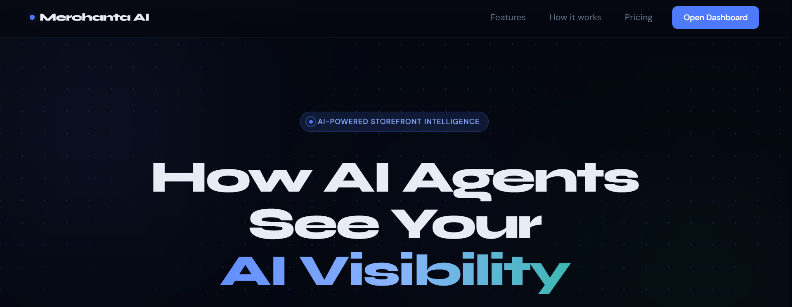

### Features Section

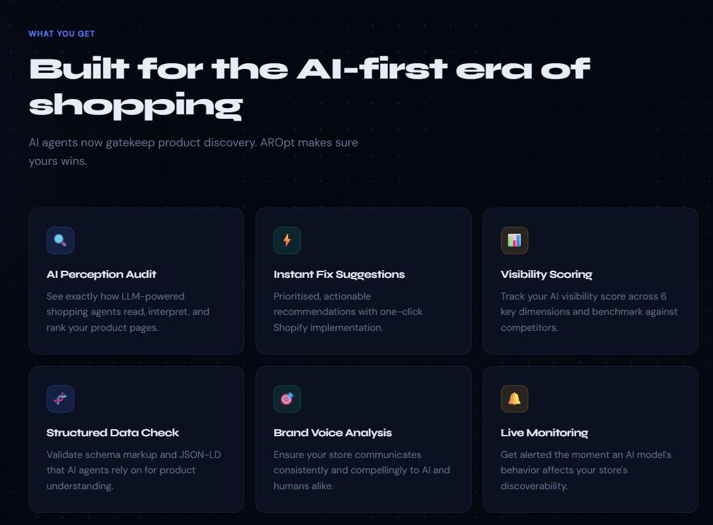

### Workflow Section

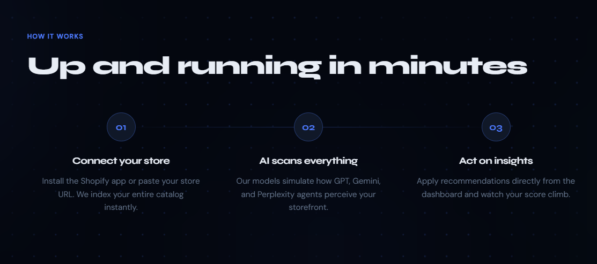

### Pricing Section

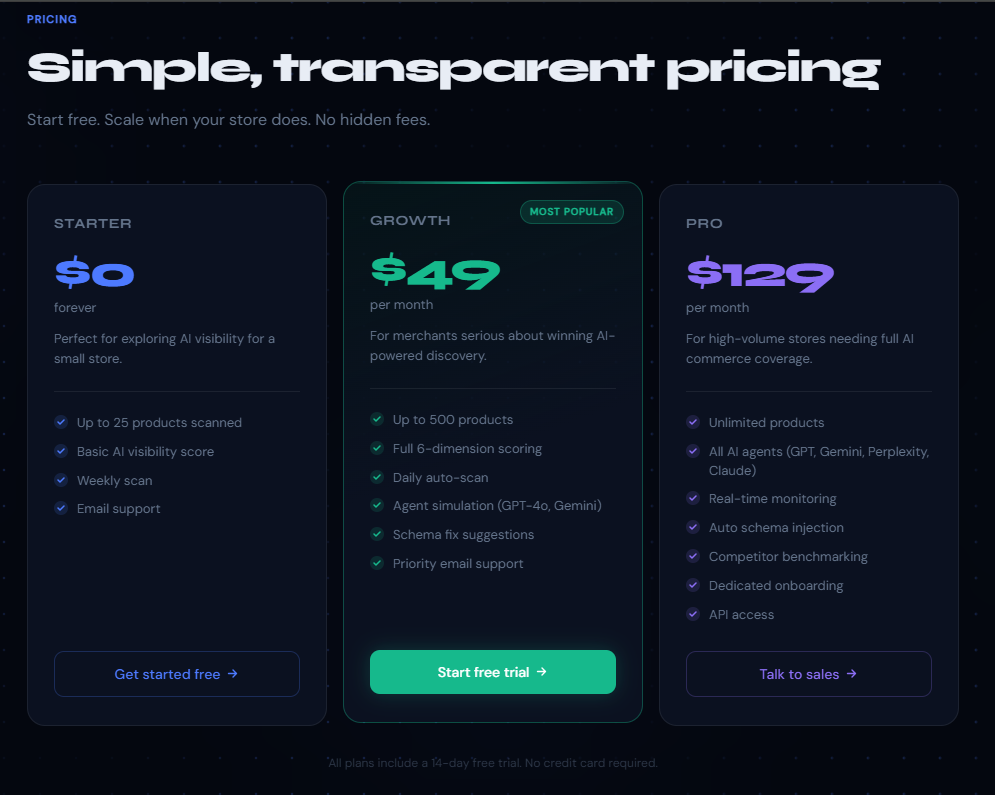

---

# Authentication

## Login Page

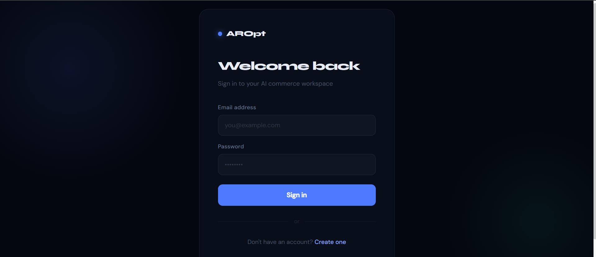

## Register Page

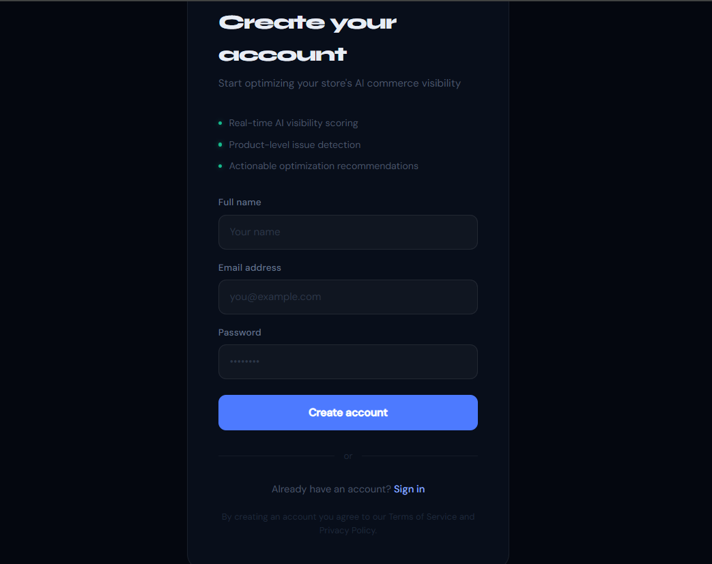

---

# Dashboard

## Dashboard Scores

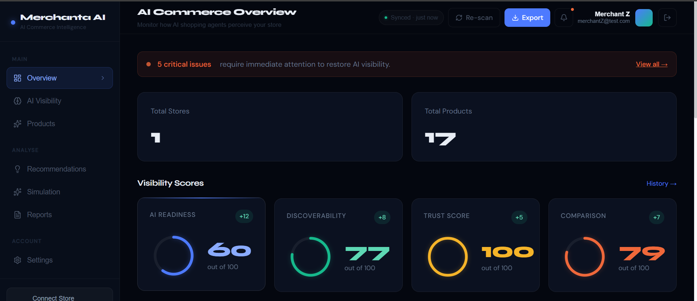

## Open Issues

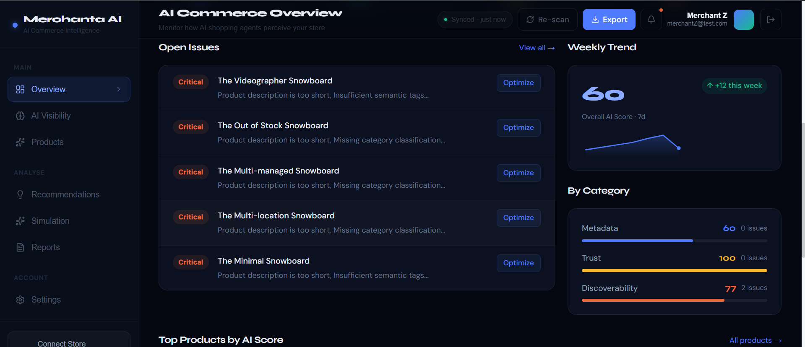

## Top Products

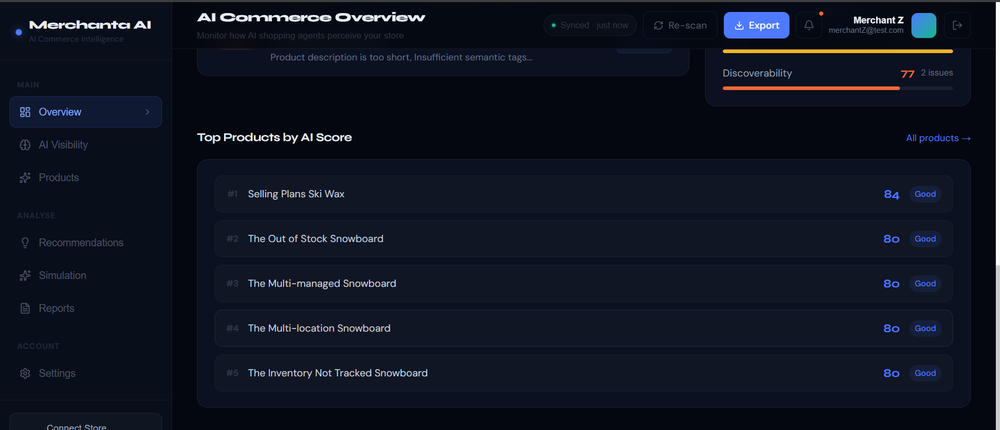

---

# Product Intelligence

## Products Page

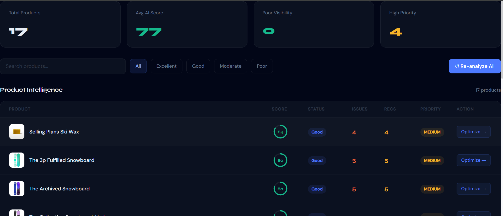

## Product Recommendations

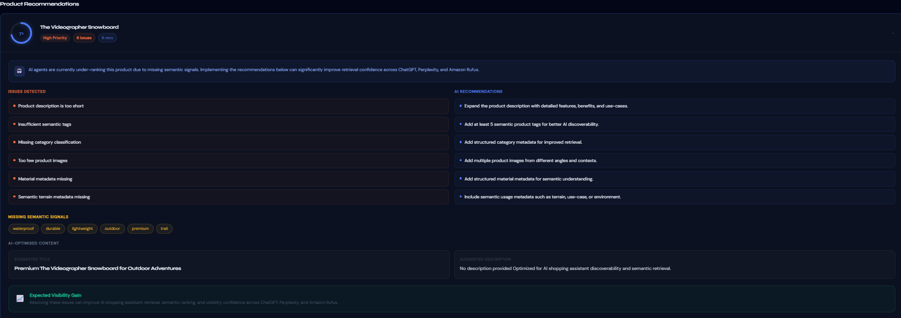

## AI Visibility Analysis

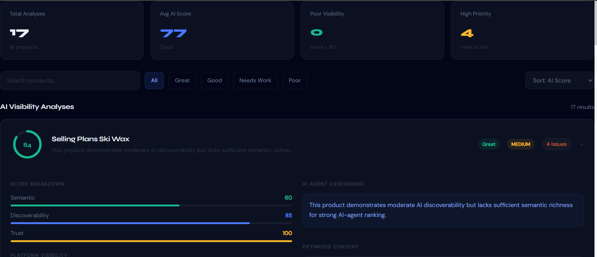

---

# Buyer Intent Simulation

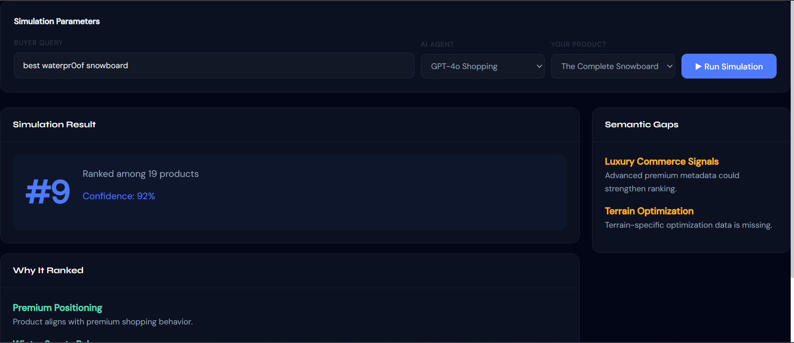

Merchanta AI dynamically simulates how AI shopping systems rank products based on buyer intent.

The simulation engine adapts ranking logic based on:

- semantic relevance
- metadata quality
- buyer behavior
- commerce context
- AI discoverability

---

# Optimization Insights

## Product Optimization Recommendations

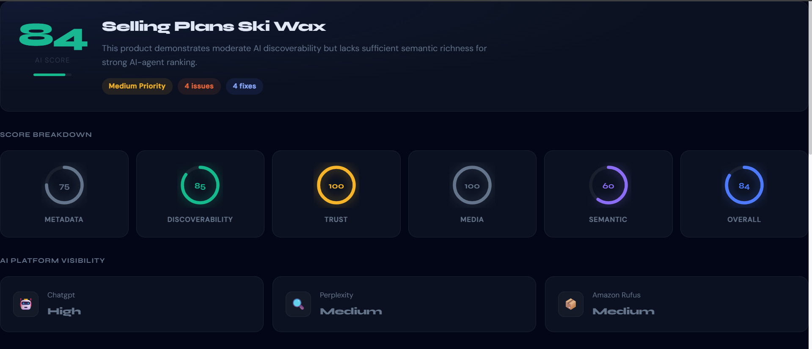

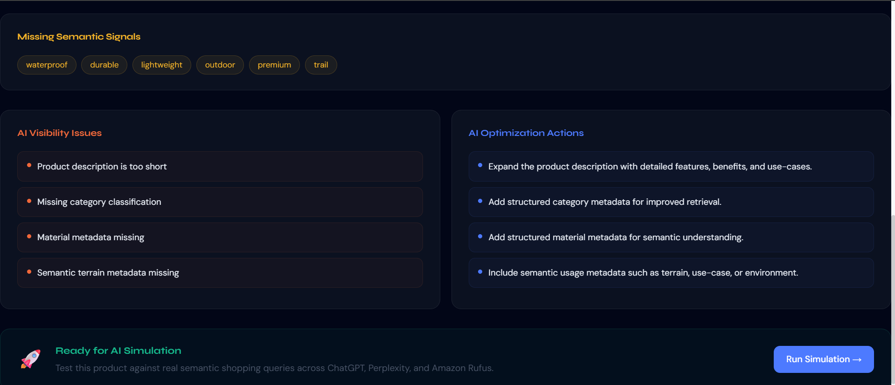

## Recommendations Dashboard

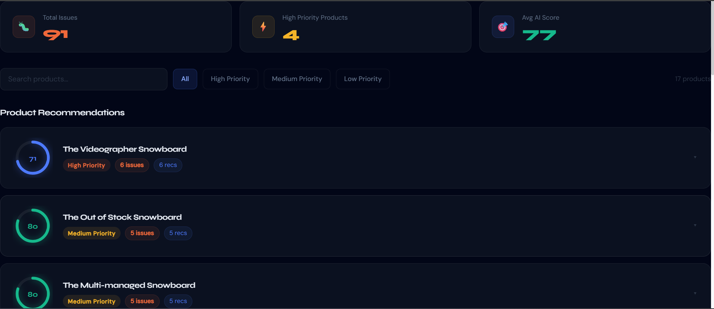

---

# Reports & Settings

## Reports

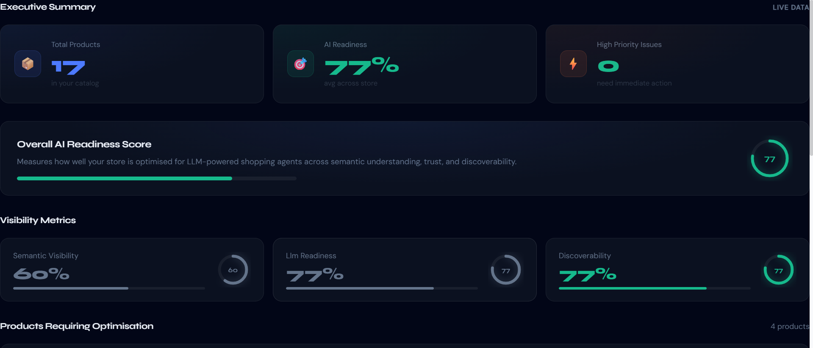

## Settings

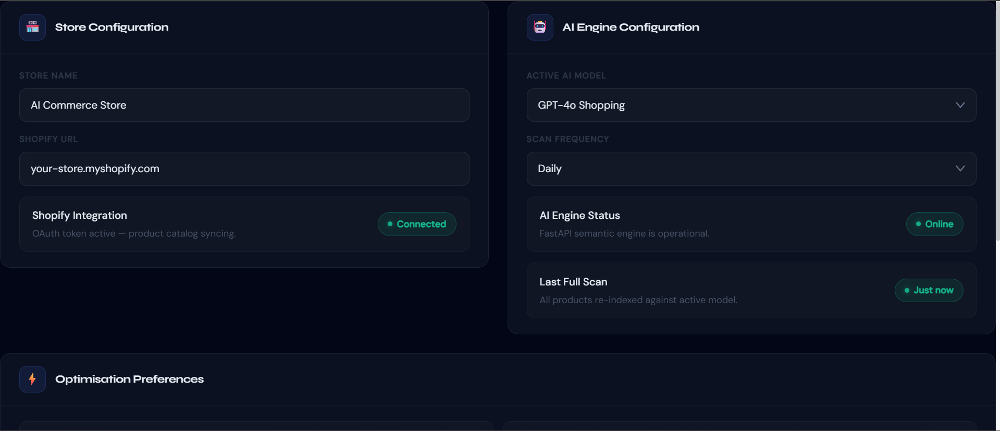

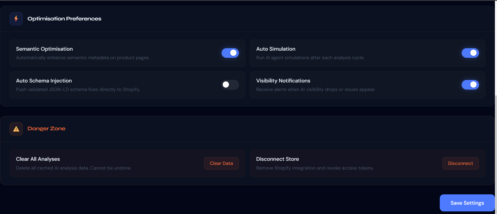

---

# Core Innovation

The core innovation behind Merchanta AI is:

> Optimizing products for AI shopping agents instead of only search engines.

The platform combines:

- semantic intelligence
- buyer-intent reasoning
- metadata diagnostics
- AI visibility evaluation
- simulation pipelines

into a unified merchant intelligence platform.

---

# Future Improvements

Potential future enhancements include:

- multi-platform commerce support
- competitor benchmarking
- advanced vector search
- real-time AI monitoring
- AI-generated metadata optimization
- policy trust evaluation
- autonomous optimization suggestions

---

# Deployment

| Service | Deployment |
|---|---|
| Frontend | Vercel |
| Backend | Render |
| AI Engine | Render |
| Database | MongoDB Atlas |

---

# Team Vision

Merchanta AI was built around a simple idea:

Businesses are entering a future where AI systems influence purchasing decisions.

Merchants need visibility into how AI agents understand and represent their products.

Merchanta AI helps businesses become:

- discoverable
- understandable
- trustworthy
- recommendable

for the next generation of AI commerce.

---

# Live Deployment

Frontend: https://merchanta-ai-frontend.vercel.app

Backend: https://merchanta-ai-backend.onrender.com

AI Engine: https://merchanta-ai-engine.onrender.com

# Demo Video

Project Demonstration Video:

https://drive.google.com/file/d/17H3uhpGs5txSZq1H0oH7a-eEbBiOYtT3/view?usp=sharing

---

# Important Note for Evaluators

The application is deployed using free-tier cloud services.

As a result:

- The Backend Server
- The AI Engine Server

may enter sleep mode after a few minutes of inactivity.

If the application appears slow initially:

1. Open the backend URL once
2. Open the AI engine URL once
3. Wait approximately 30–60 seconds for services to wake up

After waking up, the application functions normally.

Backend:
https://merchanta-ai-backend.onrender.com/health

AI Engine:
https://merchanta-ai-engine.onrender.com/
